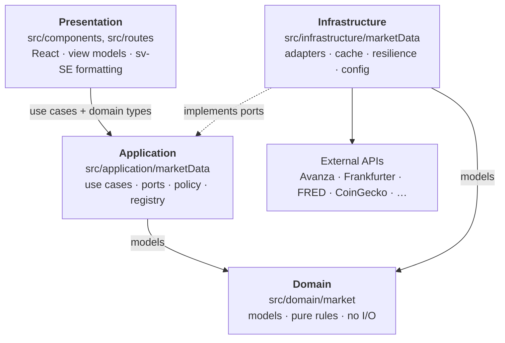
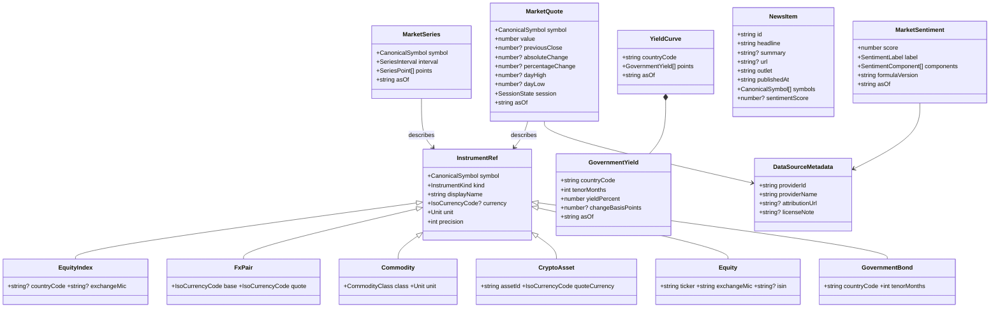
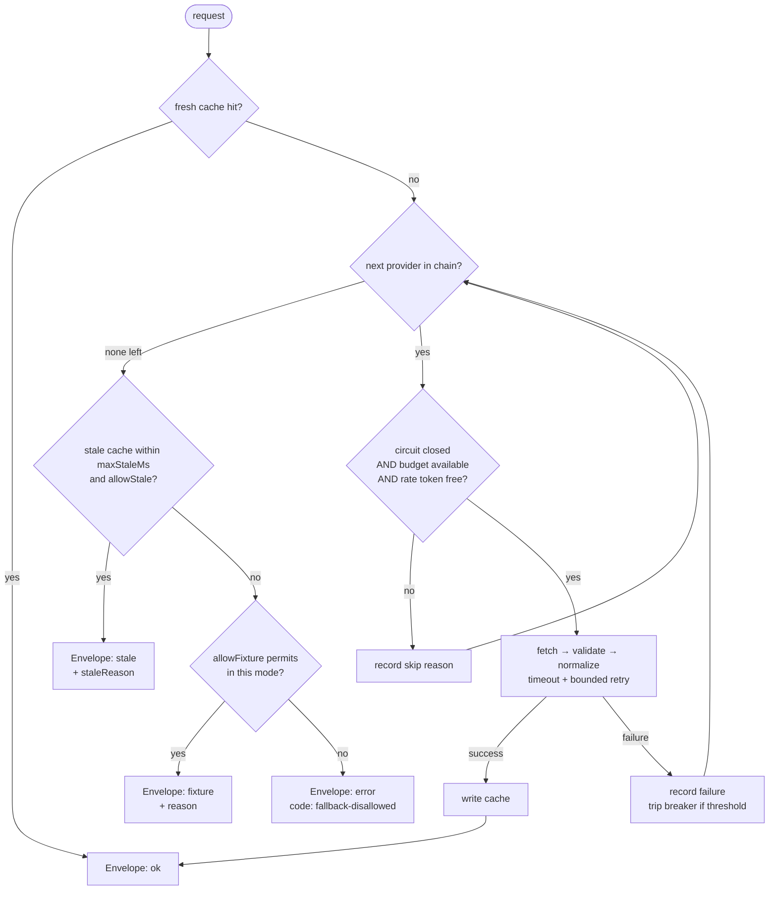

# Financial OS — data architecture

Status: **design contract. No production code has been changed.**

This document is the agreed architecture for replacing mocked Overview data with
real market data, structured so the same foundation carries the country,
portfolio and AI-agent experiences later.

**Governing principle: the application is designed around financial domain
models first, and data providers second.** The UI must never know whether a
value came from Avanza, Twelve Data, Finnhub, Polygon, a fixture, or a provider
that does not exist yet.

- **Part I — Audit** (§1–§3): what is mocked today, who consumes it, what
  providers exist. Reviewed and approved.
- **Part II — Architecture** (§4–§14): the domain-first design.
- **Part III — Execution** (§15–§17): migration sequence, open decisions, and
  the concrete plan for Architecture Phase A and Phase 0.

---

---

# Part I — Audit

## 1. Inventory of mocked data

The Overview **does not use the service layer that already exists.** There is a
working provider seam — `marketDataService` → `avanzaMcpAdapter` →
`createServerFn`, with a correct server/client split documented in
`avanzaMcp/serverFns.ts:1-16` — and `LightCommandCenter.tsx:46-57` bypasses it
entirely, importing mock modules directly. Closing that gap is Phase 0.

| #   | Value(s)                                                       | Where defined                                                | Kind                                                                                                           |
| --- | -------------------------------------------------------------- | ------------------------------------------------------------ | -------------------------------------------------------------------------------------------------------------- |
| 1   | OMXS30, S&P 500, Nasdaq 100, EUR/SEK, USD/SEK, BTC             | `src/data/mockData.ts:65-85` (`marketIndices`)               | static literals, `MOCK_NOW = 2025-03-14`                                                                       |
| 2   | DAX name/value/change (as **strings**: `'19 840'`, `'+0.32%'`) | `src/data/countryExplorer/germany.ts:294-308`                | static literals, re-parsed by `parseSignedPercent`                                                             |
| 3   | Nikkei 225 name/value/change                                   | `src/data/countryExplorer/japan.ts` (`markets`)              | static literals, same string round-trip                                                                        |
| 4   | FTSE 100 `8 363,95` / `+0.28%`                                 | `LightCommandCenter.tsx:165`                                 | inline literal                                                                                                 |
| 5   | EUR/USD, Brent, Gold, Bitcoin fallback                         | `LightCommandCenter.tsx:188-193`                             | inline literals                                                                                                |
| 6   | US 10Y yield                                                   | `src/data/countryExplorer/globalMarketOverview.ts:36-46`     | static literal (`'4.32%'`, change `+0.00 pp`)                                                                  |
| 7   | DE 10Y, US 2Y, SE 10Y                                          | `LightCommandCenter.tsx:207-209`                             | inline literals                                                                                                |
| 8   | 9 S&P sector day-moves                                         | `LightCommandCenter.tsx:214-224` (`SECTORS`)                 | inline literals                                                                                                |
| 9   | Risk sentiment gauge (`position: 72`, `risk-on`)               | `globalMarketOverview.ts:64-67`                              | inline literal, self-documented as "not a computed signal"                                                     |
| 10  | News feed (4 items)                                            | `src/data/countryExplorer/index.ts:44` (`getGlobalNewsFeed`) | hand-written fixtures from 4 country files, timestamps relative to `COUNTRY_MOCK_NOW = 2026-07-22T16:24+02:00` |
| 11  | Every market-card sparkline                                    | `LightCommandCenter.tsx:109` (`seededSeries`) → `:149`       | **mulberry32 PRNG random walk**                                                                                |
| 12  | Entire intraday chart, all 4 series × all 6 ranges             | `LightCommandCenter.tsx:239` (`buildIntraday`)               | **PRNG random walk**                                                                                           |
| 13  | Yield-curve sparkline (`RATE_CURVE`)                           | `LightCommandCenter.tsx:257`                                 | **PRNG noise — not a curve**                                                                                   |
| 14  | Watchlist tiles (6 names, prices, sparks)                      | `src/data/mockData.ts:123-190`                               | static literals                                                                                                |
| 15  | "Data uppdaterad HH:MM"                                        | `LightCommandCenter.tsx:955-963`                             | **`new Date()` at render — reports render time, not data time**                                                |
| 16  | Greeting name "Anders"                                         | `LightCommandCenter.tsx:371`                                 | inline literal (user profile, not market data)                                                                 |

### Genuinely real today — keep

- `MARKET_CENTERS` + `getMarketStatus` (`marketCenters.ts`) — a pure function of
  the real clock against published exchange session hours. Not fetched, but not
  fake. Gap: no holiday calendar, so an exchange holiday reads as CLOSED.
- `useClock()` — real wall clock, correctly hydration-guarded via `mounted`.

### Defects (scheduled in §15, not hidden behind the new abstraction)

| ID     | Defect                                                                                                                                           | Fixed in                                            |
| ------ | ------------------------------------------------------------------------------------------------------------------------------------------------ | --------------------------------------------------- |
| **D1** | `indexQuote('bitcoin')` never matches — mock id is `'btc'` (`mockData.ts:78`), so `:191` always falls through to a hardcoded literal. Dead code. | Phase 0                                             |
| **D2** | Financial values stored and parsed as localized strings (`'19 840'` → `parseSignedPercent`).                                                     | Phase 0 (domain), Phase 5 (source)                  |
| **D3** | Frozen clocks `MOCK_NOW` (2025-03-14) and `COUNTRY_MOCK_NOW` (2026-07-22) leak into rendered output.                                             | Phase 0                                             |
| **D4** | Intraday x-axis is always 09:00–17:00 regardless of range — `1M`/`YTD` show one day's hour labels.                                               | Phase 6                                             |
| **D5** | "Data uppdaterad" prints render time, not data time. The one label a user would trust for freshness is fabricated.                               | Phase 0                                             |
| **D6** | `RATE_CURVE` is PRNG noise presented as a yield curve.                                                                                           | Phase 4 (replace); removed earlier if Phase 4 slips |

## 2. Components consuming each source

All within `LightCommandCenter.tsx` — the Overview is one file.

| Panel                    | Function                             | Consumes                      |
| ------------------------ | ------------------------------------ | ----------------------------- |
| "Marknadsöversikt" cards | `buildMarketCards()` `:143`          | #1, #2, #3, #4, #11           |
| "Aktuella marknader"     | `buildCurrentMarkets()` `:181`       | #1, #5                        |
| "Räntemarknaden"         | `buildRates()` `:198` + `RATE_CURVE` | #6, #7, #13                   |
| "Sektorer (S&P 500)"     | `SECTORS` `:214`                     | #8                            |
| "Sentiment"              | `GLOBAL_RISK_SENTIMENT` `:526`       | #9                            |
| "Senaste nytt"           | `getGlobalNewsFeed(4)` `:524`        | #10                           |
| "Utveckling idag"        | `buildIntraday(range)` `:525`        | #12                           |
| "Bevakning"              | `watchlist.slice(0,6)` `:911`        | #14                           |
| Bottom ticker rail       | `tickerItems` `:528`                 | derived from #1–#5            |
| Header status + clock    | `Header()` `:345`                    | real clock + `MARKET_CENTERS` |
| Globe                    | `LightGlobe`                         | locked, out of scope          |

Shared components that must not change visually: `Sparkline`, `ChartTooltip`,
`SectionCard`, `ChangeText`, recharts `LineChart`.

## 3. Provider landscape

Verified July 2026. Free-tier terms move — re-verify before committing spend.

| Category                                    | Recommendation                                                          | Free?            | Key limits                                                                  |
| ------------------------------------------- | ----------------------------------------------------------------------- | ---------------- | --------------------------------------------------------------------------- |
| FX                                          | **Frankfurter**                                                         | ✅ permanent     | no key, no rate limit; ECB reference rates, published once daily ~16:00 CET |
| Government yields                           | **FRED** + **US Treasury**; **Riksbank** for SE; ECB Data Portal for EA | ✅ permanent     | FRED needs a free key; all EOD                                              |
| Crypto                                      | **CoinGecko Demo**                                                      | ✅ permanent     | 100 calls/min, 10 000 calls/month                                           |
| SE equities + OMXS30                        | **Avanza MCP** (already built)                                          | ✅ permanent     | unauthenticated public API, no key                                          |
| News                                        | **Marketaux**                                                           | ✅ at 15-min TTL | **100 requests/day**                                                        |
| Foreign indices, commodities, VIX, intraday | **Twelve Data Grow**                                                    | ❌ ~$29/mo       | free tier excludes indices; 800 calls/day, 8/min                            |
| Sentiment                                   | derived in-house                                                        | ✅               | no credible free risk-on/off feed exists                                    |

Rejected: Alpha Vantage (25 calls/**day** — too small for a 6-tile grid),
Polygon.io (no free tier; revisit only if this goes commercial), NewsAPI.org
($449/mo), API Ninjas commodities (7 rotating commodities/week — unusable for a
fixed panel), GDELT (free but needs heavy filtering).

**The refresh cadence in §12 is quota arithmetic, not taste.** Twelve Data bills
per symbol: 6 index tiles at 60 s = 8 640 calls/day against an 800/day cap, 11×
over; at a 15-min TTL over an 8 h session it is ~192/day and fits. Marketaux at
100/day dies by mid-afternoon on a 5-min TTL; 15 min gives ~40/day.

---

---

# Part II — Architecture

## 4. Layering and dependency direction

Four layers, with dependencies pointing **inward only**. The domain knows
nothing about anything else.



Rules, enforced by the boundary test in §13:

1. `domain/` imports nothing outside `domain/`. No React, no `fetch`, no
   `process.env`, no formatting, no locale.
2. `application/` imports `domain/` and its own **ports** (interfaces). It never
   imports a concrete provider, an HTTP client, or `infrastructure/`.
3. `infrastructure/` imports `domain/` and implements `application/` ports.
   Provider-specific response types never escape their adapter file.
4. `presentation/` imports `application/` use cases and `domain/` types. It
   never imports `infrastructure/`.
5. The **composition root** — `infrastructure/marketData/serverFns.ts` — is the
   single place where concrete providers are wired to ports, and the single
   client-reachable surface.

### Proposed directory layout

Files marked ✅ shipped in Architecture Phase A.

```
src/
  domain/shared/
    clock.ts           ✅ Clock, SystemClock, FakeClock — time is injected, never read

  domain/market/
    primitives.ts      ✅ Percent, BasisPoints, Price, YieldPercent, Money, IsoCurrencyCode
    provenance.ts      ✅ Unit, Quality, DataSourceMetadata, Provenance, Envelope, DomainError
    instruments.ts     ✅ CanonicalSymbol, InstrumentRef and its kinds (identity)
    symbols.ts         ✅ canonical instrument catalog (single source of identity)
    observations.ts    ✅ MarketQuote, MarketSeries
    rates.ts           ✅ GovernmentYield, YieldCurve
    news.ts            ✅ NewsItem
    sentiment.ts       ✅ MarketSentiment, SentimentOrigin + derivation rules
    events.ts          ✅ domain event contracts (definitions only — no bus)
    index.ts           ✅ public barrel

  application/marketData/
    ports.ts           ✅ QuoteProvider, SeriesProvider, FxProvider, …
    policy.ts          ✅ per-category TTL, FallbackPolicy, staleness limits
    providerRegistry.ts ✅ capability -> ordered chain resolution
    getOverviewSnapshot.ts   (Phase 0)
    getQuotes.ts  getYieldSnapshot.ts  getNews.ts  calculateSentiment.ts   (Phase 0+)

  infrastructure/marketData/
    config.ts          ✅ env schema, validation, live-readiness check
    container.ts       ✅ composition root factory
    keys.ts            ✅ normalized cache-key construction
    cache/store.ts     ✅ CacheStore interface + MemoryCacheStore
    cache/             disk.ts  singleFlight.ts                            (Phase 1)
    resilience/        tokenBucket.ts  circuitBreaker.ts  retry.ts  timeout.ts  (Phase 1)
    providers/         avanza · frankfurter · fred · treasury · riksbank ·
                       coingecko · twelveData · marketaux · fixture        (Phase 0+)
      __fixtures__/    recorded provider payloads for contract tests
    serverFns.ts       ← only client-reachable module                      (Phase 0)

  presentation/marketData/
    viewModels.ts      domain -> sv-SE display strings (the ONLY formatter) (Phase 0)

  test/
    importGraph.test.ts ✅ T3 + T4 + T16 architectural fitness tests
```

### Value objects (Phase A addition)

Financial primitives are **branded numbers with smart constructors**, not
wrapper classes. A wrapper (`new Percent(0.32)`) buys the same compile-time
safety at three runtime costs this app should not pay: it allocates on every
quote, it does not survive `JSON.stringify` across the `createServerFn`
boundary without a bespoke revive step, and it forces `.value` unwrapping at
every arithmetic site. A brand is erased at compile time — the runtime
representation is a plain `number`, so a snapshot serializes and revives with
no custom logic, while the type system still refuses to assign basis points to
a percent.

`Money` is the exception: its purpose is to bind an amount to a currency, which
a brand on `number` cannot express, so it is a plain data interface (still
JSON-safe, no methods) with pure helpers. `addMoney` refuses to mix currencies —
there is no implicit FX conversion anywhere in the domain, because converting
needs a rate and a timestamp and must not hide inside an operator.

`Yield` from the requested list is served by `YieldPercent` plus the existing
`GovernmentYield` model; a separate value object would have duplicated it.

### Clock (Phase A addition)

No code below the presentation layer calls `Date.now()` or `new Date()`. Time is
an input, injected via `Clock` (`domain/shared/clock.ts`) and carried on
`FetchContext`. `SystemClock` is the single sanctioned caller of `Date.now()`,
enforced by the T3 fitness test. `FakeClock` makes TTL expiry, staleness
thresholds, rate-limit windows, breaker cooldowns and budget resets testable
without sleeping — and is what will let the Phase 0 fixture provider be
provably deterministic (gate G4).

### Domain events (Phase A addition)

`domain/market/events.ts` defines `MarketQuoteUpdated`, `MarketSeriesUpdated`,
`GovernmentYieldUpdated`, `NewsItemReceived`, `SentimentUpdated` and
`OverviewSnapshotUpdated` as a discriminated union, plus a `DomainEventHandler`
signature. **There is no bus, and nothing publishes or consumes them** — by
design. They exist so the AI-agent and event-driven work later starts from
agreed, versioned shapes rather than inventing them at the first call site.
Conventions recorded for whoever wires the bus: events carry domain models
never provider payloads, they are immutable and past-tense, `occurredAt` is
distinct from the payload's own `asOf`, and `eventVersion` is per event type so
one payload can evolve without a global migration.

### Relationship to the existing seam (§8 of the brief)

The existing architecture is kept and evolved, not discarded:

| Existing                                                                       | Disposition                                                                                                                   |
| ------------------------------------------------------------------------------ | ----------------------------------------------------------------------------------------------------------------------------- |
| `services/avanzaMcp/client.ts` (MCP stdio transport, single-flight connection) | **Keep verbatim.** Becomes the transport used by `providers/avanza.ts`.                                                       |
| `services/avanzaMcp/mappers.ts`                                                | **Keep, retarget.** Maps to domain models instead of `~/types`.                                                               |
| `services/avanzaMcp/serverFns.ts`                                              | **Keep** while other routes depend on it; the new composition root supersedes it for the Overview.                            |
| `services/marketDataService.ts` + `avanzaMcpAdapter.ts`                        | **Keep running** for `/portfolio`, `/watchlist`, `/markets`, `/agents`. Migrating those routes is out of scope for this plan. |
| `src/types/index.ts`                                                           | Stays as the legacy contract for unmigrated routes. New domain models live in `domain/market/`; no big-bang rename.           |

The `createServerFn` + dynamic-`import()` guard pattern documented in
`avanzaMcp/serverFns.ts:11-15` is the precedent the whole infrastructure layer
follows.

## 5. Domain model

### Identity vs observation

The brief lists the models flat. The one structural refinement I would make:
separate **instrument identity** (what a thing _is_ — stable reference data)
from **observations** (what it _did_ at a point in time). Without that split,
`MarketIndex` and `MarketQuote` overlap and every model re-declares
name/currency/precision.



### Coverage of the requested model list

| Requested model       | Disposition                                                                                                                                                    | Where             |
| --------------------- | -------------------------------------------------------------------------------------------------------------------------------------------------------------- | ----------------- |
| `MarketQuote`         | **Build now**                                                                                                                                                  | `observations.ts` |
| `MarketSeries`        | **Build now**                                                                                                                                                  | `observations.ts` |
| `MarketIndex`         | **Build now** as `InstrumentRef` kind `'equity-index'`                                                                                                         | `instruments.ts`  |
| `FXPair`              | **Build now** as `InstrumentRef` kind `'fx-pair'`                                                                                                              | `instruments.ts`  |
| `GovernmentYield`     | **Build now**                                                                                                                                                  | `rates.ts`        |
| `YieldCurve`          | **Build now** (needed to retire D6)                                                                                                                            | `rates.ts`        |
| `Commodity`           | **Build now** as `InstrumentRef` kind `'commodity'`                                                                                                            | `instruments.ts`  |
| `CryptoAsset`         | **Build now** as `InstrumentRef` kind `'crypto'`                                                                                                               | `instruments.ts`  |
| `NewsItem`            | **Build now**                                                                                                                                                  | `news.ts`         |
| `MarketSentiment`     | **Build now**                                                                                                                                                  | `sentiment.ts`    |
| `DataSourceMetadata`  | **Build now**                                                                                                                                                  | `provenance.ts`   |
| `EconomicIndicator`   | **Defer** — no Overview consumer. Intended for the country experience; `globalIndicators.ts` and `globalHeadlineMacro.ts` are the future migration targets.    | documented only   |
| `CountryMacro`        | **Defer** — `types/countryExplorer.ts:CountryMacroData` already serves the country modal. Reconcile when the country experience migrates.                      | documented only   |
| `MarketRegime`        | **Defer** — a derived classification (risk-on/off + volatility + rate direction) over `MarketSentiment` plus trend. No consumer until the AI-agent experience. | documented only   |
| `PortfolioHolding`    | **Defer** — `types/index.ts:Holding` serves `/portfolio` today. Migrate with that route.                                                                       | documented only   |
| `PortfolioAllocation` | **Defer** — `types/index.ts:AllocationSlice` serves `/portfolio` today.                                                                                        | documented only   |

Eleven models built now, five documented as intended extensions. No empty
abstractions.

## 6. Normalized model definitions

`src/domain/market/` — numeric, unit-explicit, locale-free, provider-free.

```ts
/* ---------------------------------------------------------- provenance.ts */

/** ISO 4217. Null where the concept does not apply (an index level, a yield). */
export type IsoCurrencyCode = string & { readonly __iso4217: unique symbol }

/** Explicit unit of the numeric value. Never inferred from the symbol. */
export type Unit =
  | { kind: 'index-points' }
  | { kind: 'currency'; currency: IsoCurrencyCode }
  | { kind: 'fx-rate'; base: IsoCurrencyCode; quote: IsoCurrencyCode }
  | { kind: 'percent' }
  | { kind: 'basis-points' }
  | {
      kind: 'per-physical'
      currency: IsoCurrencyCode
      measure: 'bbl' | 'troy_oz' | 'mt' | 'mmbtu'
    }

/**
 * How the value relates to the real market. Primary classification, and
 * orthogonal to Envelope state: `quality` describes the NATURE of the value,
 * `state` describes its FRESHNESS. A derived value computed from stale inputs
 * is `quality: 'derived'` in `state: 'stale'` — both facts are preserved.
 */
export type Quality = 'realtime' | 'delayed' | 'eod' | 'derived' | 'fixture'

export interface DataSourceMetadata {
  providerId: string // 'frankfurter' | 'fred' | 'avanza' | 'fixture' | …
  providerName: string // human-readable, for attribution
  attributionUrl?: string // some free tiers require visible attribution
  licenseNote?: string
}

/** Provenance travelling with every resolved value. */
export interface Provenance {
  /** When the provider observed the value. */
  asOf: string // ISO 8601 with offset
  /** When we retrieved it. */
  receivedAt: string // ISO 8601 with offset
  /** now - asOf at resolution time. */
  ageMs: number
  source: DataSourceMetadata
  quality: Quality
  isDelayed: boolean
  /** Known provider delay; null when unquantified. */
  delayMinutes: number | null
  /** True when this instrument stands in for the requested one (ETF for index). */
  isProxy: boolean
  /** Required when isProxy — what was substituted, for the UI to disclose. */
  proxyNote?: string
}

/* ---------------------------------------------------------- instruments.ts */

/** Namespaced canonical id. The ONE identity used across the whole system. */
export type CanonicalSymbol = string & { readonly __canonical: unique symbol }
// 'idx:sp500'  'fx:eurusd'  'rate:us10y'  'cmd:brent'  'crypto:btc'  'eq:xsto:INVE-B'

export type InstrumentKind =
  'equity-index' | 'fx-pair' | 'commodity' | 'crypto' | 'equity' | 'government-bond'

export interface InstrumentRefBase {
  symbol: CanonicalSymbol
  kind: InstrumentKind
  /** Locale-neutral canonical name ('S&P 500'). NOT a localized display string. */
  displayName: string
  currency: IsoCurrencyCode | null
  unit: Unit
  /** Decimals for presentation. Reference data, not formatting — 4 for FX, 0 for BTC. */
  precision: number
}

export type InstrumentRef =
  | (InstrumentRefBase & {
      kind: 'equity-index'
      countryCode?: string
      exchangeMic?: string
    })
  | (InstrumentRefBase & {
      kind: 'fx-pair'
      base: IsoCurrencyCode
      quote: IsoCurrencyCode
    })
  | (InstrumentRefBase & {
      kind: 'commodity'
      commodityClass: 'energy' | 'metal' | 'agri'
    })
  | (InstrumentRefBase & {
      kind: 'crypto'
      assetId: string
      quoteCurrency: IsoCurrencyCode
    })
  | (InstrumentRefBase & {
      kind: 'equity'
      ticker: string
      exchangeMic: string
      isin?: string
    })
  | (InstrumentRefBase & {
      kind: 'government-bond'
      countryCode: string
      tenorMonths: number
    })

/* --------------------------------------------------------- observations.ts */

export type SessionState = 'open' | 'closed' | 'pre-market' | 'after-hours' | 'unknown'

export interface MarketQuote {
  symbol: CanonicalSymbol
  /** Current level or price, in `unit`. Numeric. Never a formatted string. */
  value: number
  /** Prior official close. Null when the provider does not supply one. */
  previousClose: number | null
  /** value - previousClose, in `unit`. Null when previousClose is null. */
  absoluteChange: number | null
  /** Percent, e.g. 0.32 means +0.32%. Null when it cannot be derived honestly. */
  percentageChange: number | null
  dayHigh: number | null
  dayLow: number | null
  session: SessionState
  provenance: Provenance
}

export type SeriesInterval = '1m' | '5m' | '15m' | '1h' | '1d' | '1w' | '1mo'

export interface SeriesPoint {
  t: string // ISO 8601 with offset
  v: number // absolute value in the instrument's unit
}

export interface MarketSeries {
  symbol: CanonicalSymbol
  interval: SeriesInterval
  /** Absolute values. Percent-rebasing for a comparison chart is presentation. */
  points: SeriesPoint[]
  provenance: Provenance
}

/* ----------------------------------------------------------------- rates.ts */

export interface GovernmentYield {
  symbol: CanonicalSymbol
  countryCode: string // ISO 3166-1 alpha-2
  tenorMonths: number // 24 = 2Y, 120 = 10Y
  /** Percent per annum, e.g. 4.32. Unit is always { kind: 'percent' }. */
  yieldPercent: number
  /** Change in basis points — the market's unit for rates, never percent. */
  changeBasisPoints: number | null
  provenance: Provenance
}

export interface YieldCurve {
  countryCode: string
  /** Ascending by tenorMonths. A real curve, replacing the PRNG sparkline (D6). */
  points: GovernmentYield[]
  provenance: Provenance
}

/* ------------------------------------------------------------------ news.ts */

export interface NewsItem {
  id: string
  headline: string
  summary: string | null
  url: string | null
  outlet: string
  publishedAt: string // ISO 8601 with offset
  symbols: CanonicalSymbol[]
  /** -1..1. Null when the provider gives none — never fabricated. */
  sentimentScore: number | null
  provenance: Provenance
}

/* ------------------------------------------------------------- sentiment.ts */

export type SentimentLabel = 'risk-off' | 'neutral' | 'risk-on'

/**
 * Three distinct things that must never share one quality label (D2).
 * - 'derived'  — computed in-house from real or explicitly stale market inputs.
 *                Permitted in production; provenance and methodology preserved.
 * - 'provider' — a vendor's own sentiment figure. Quality is theirs
 *                ('realtime' | 'delayed'), not 'derived'.
 * - 'fixture'  — invented. Non-production only.
 */
export type SentimentOrigin = 'derived' | 'provider' | 'fixture'

export interface SentimentComponent {
  id: string // 'vix' | 'us10y-change' | 'dxy-change' | 'btc-24h'
  label: string
  /** Signed contribution to `score`. Components must sum to score - baseline. */
  contribution: number
  /** The domain value the contribution was computed from, for explainability. */
  inputValue: number
  /** When THAT input was observed. A derived score is only as fresh as this. */
  inputAsOf: string // ISO 8601 with offset
  /** Quality of the input itself — a derived score over fixture inputs is a fixture. */
  inputQuality: Quality
}

export interface MarketSentiment {
  /** 0..100, higher = more risk-on. Feeds the gauge position directly. */
  score: number
  label: SentimentLabel
  origin: SentimentOrigin
  components: SentimentComponent[]
  /** Methodology version. Bumped whenever weights change, so historical
   *  scores stay interpretable. Required for `origin: 'derived'`. */
  formulaVersion: string // 'v1'
  provenance: Provenance
}
```

**Derivation rules for sentiment**, enforced in `calculateSentiment`:

1. `provenance.asOf` = the **oldest** `inputAsOf` across components. A derived
   score is never fresher than its stalest input.
2. `provenance.quality` = `'derived'` — _unless_ any component has
   `inputQuality: 'fixture'`, in which case the whole score degrades to
   `'fixture'` and inherits the non-production policy. Deriving from invented
   inputs produces an invented output; the type system should not let that be
   laundered into a production-eligible value.
3. Envelope `state` reflects input freshness independently: real-but-stale
   inputs give `state: 'stale'`, `quality: 'derived'` — permitted in production
   with its `staleReason` and input timestamps intact.
4. `formulaVersion` is required whenever `origin === 'derived'`.

Deliberate exclusions from the domain layer: no `formatNumber` output, no
`sv-SE` strings, no `'+0.32%'`, no colour, no precision-as-formatting, no
recharts shapes. All of that is §11.

## 7. Envelope state model

```ts
/* ---------------------------------------------------------- provenance.ts */

export type StaleReason =
  | 'provider-error'
  | 'rate-limited'
  | 'budget-exhausted'
  | 'circuit-open'
  | 'timeout'
  | 'offline'
  | 'no-fresh-source'

export type ErrorCode =
  | 'network'
  | 'auth'
  | 'rate-limit'
  | 'schema'
  | 'not-found'
  | 'timeout'
  | 'circuit-open'
  | 'budget-exhausted'
  | 'no-provider-configured'
  | 'fallback-disallowed'
  | 'unknown'

export interface DomainError {
  code: ErrorCode
  /** Safe to log and display. Never contains an API key or raw provider body. */
  message: string
  providerId: string | null
  retryable: boolean
  retryAfterMs?: number
}

export type Envelope<T> =
  | { state: 'loading' }
  | { state: 'ok'; data: T; provenance: Provenance }
  | { state: 'stale'; data: T; provenance: Provenance; staleReason: StaleReason }
  | { state: 'fixture'; data: T; provenance: Provenance; reason: string }
  | {
      state: 'error'
      error: DomainError
      /**
       * Last known good value, when one exists. Present so a caller CAN choose
       * to show it — but `state` stays 'error', so nothing renders it as live
       * by accident.
       */
      lastGood?: { data: T; provenance: Provenance }
    }
```

`ageMs`, `asOf`, `receivedAt`, `source`, `quality`, `isDelayed` and `isProxy`
live on `Provenance` (§6) rather than being duplicated per state — one shape,
always present on any state that carries data.

### Error is a real state

Correcting the earlier proposal: **fixture fallback does not make `error`
unreachable.** Whether a fixture may stand in is a per-category policy decision,
because for some data showing a plausible-looking number is worse than showing
nothing.

```ts
/* --------------------------------------------- application/marketData/policy.ts */

export interface FallbackPolicy {
  /** Serve a cached value past its TTL. */
  allowStale: boolean
  /** Hard ceiling; beyond this the value is discarded rather than shown. */
  maxStaleMs: number
  /** When a fixture may substitute for a live value. */
  allowFixture: 'never' | 'non-production' | 'always'
  /** Whether a labelled proxy instrument may substitute (ETF for index). */
  allowProxy: boolean
}
```

**Approved 2026-07-26 (D2).** Every category is `non-production` — there is no
category in which a fabricated value may be shown to a production user.

| Category        | `allowStale` | `maxStaleMs` | `allowFixture`   | `allowProxy`                   | Why                                                                                                                           |
| --------------- | ------------ | ------------ | ---------------- | ------------------------------ | ----------------------------------------------------------------------------------------------------------------------------- |
| Equity indices  | yes          | 4 h          | `non-production` | **requires approval** (§17 D1) | a stale index level is informative; a fabricated one is not                                                                   |
| FX              | yes          | 48 h         | `non-production` | no                             | ECB rates are daily; a 1-day-old rate is legitimate                                                                           |
| Yields          | yes          | 5 d          | `non-production` | no                             | EOD series; weekends are normal                                                                                               |
| Commodities     | yes          | 8 h          | `non-production` | no                             |                                                                                                                               |
| Crypto          | yes          | 2 h          | `non-production` | no                             | 24/7 market, staleness is meaningful                                                                                          |
| News            | yes          | 24 h         | `non-production` | n/a                            | **plausible fabricated headlines are the worst failure mode on the screen** — a labelled unavailable state is strictly better |
| Sentiment       | yes          | 6 h          | `non-production` | n/a                            | fixture sentiment only; **derived sentiment is not a fixture** — see below                                                    |
| Intraday series | yes          | 4 h          | `non-production` | inherits index policy          |                                                                                                                               |
| Watchlist       | yes          | 4 h          | `non-production` | no                             |                                                                                                                               |

Sentiment is the one category where the distinction matters most, so it is
spelled out (D2):

| Origin                                 | `quality`                                | Production?                                   |
| -------------------------------------- | ---------------------------------------- | --------------------------------------------- |
| **Derived** from real inputs           | `derived`                                | ✅ yes, with provenance + `formulaVersion`    |
| **Derived** from real but stale inputs | `derived`, `state: 'stale'`              | ✅ yes, with `staleReason` + input timestamps |
| **Derived** from fixture inputs        | `fixture` (degraded, see §6 rule 2)      | ❌ no                                         |
| **Provider-supplied**                  | `realtime` / `delayed` — _not_ `derived` | ✅ yes                                        |
| **Fixture**                            | `fixture`                                | ❌ no                                         |

When policy forbids the only available fallback, the result is
`{ state:'error', code:'fallback-disallowed' }`, optionally carrying `lastGood`
with full provenance — a genuine error or an explicitly-old value, never a
convincing lie. In `MARKETDATA_MODE=fixture` (dev, CI, demo) `allowFixture` is
treated as `always` for every category, which is what keeps Phase 0 and Phase 1
fully functional with no network and no keys.

### Live-readiness check

A consequence of "every category is `non-production`": in
`MARKETDATA_MODE=live`, any category whose chain is still fixture-only produces
an error state rather than content. That is correct behaviour, but it must not
be discovered in production. `config.ts` therefore performs a **startup
live-readiness check**: when `MARKETDATA_MODE=live`, any category whose
configured chain contains no provider other than `fixture` is logged as a
startup error naming the category. Phases 2–9 each clear one such warning.

## 8. Capability-based provider interfaces (ports)

Small interfaces, one per capability. A provider implements only what it can do.

```ts
/* ---------------------------------------- application/marketData/ports.ts */

export type Capability =
  'quotes' | 'series' | 'fx' | 'yields' | 'commodities' | 'crypto' | 'news' | 'sentiment'

/** Common to every port. `id` is what appears in DataSourceMetadata. */
export interface ProviderIdentity {
  readonly id: string
  readonly name: string
  readonly attributionUrl?: string
}

export interface QuoteProvider extends ProviderIdentity {
  fetchQuotes(symbols: CanonicalSymbol[], ctx: FetchContext): Promise<MarketQuote[]>
}

export interface SeriesProvider extends ProviderIdentity {
  fetchSeries(
    symbol: CanonicalSymbol,
    interval: SeriesInterval,
    range: { from: string; to: string },
    ctx: FetchContext,
  ): Promise<MarketSeries>
}

export interface FxProvider extends ProviderIdentity {
  fetchFxRates(pairs: CanonicalSymbol[], ctx: FetchContext): Promise<MarketQuote[]>
}

export interface YieldProvider extends ProviderIdentity {
  fetchYields(symbols: CanonicalSymbol[], ctx: FetchContext): Promise<GovernmentYield[]>
  fetchYieldCurve?(countryCode: string, ctx: FetchContext): Promise<YieldCurve>
}

export interface CommodityProvider extends ProviderIdentity {
  fetchCommodities(symbols: CanonicalSymbol[], ctx: FetchContext): Promise<MarketQuote[]>
}

export interface CryptoProvider extends ProviderIdentity {
  fetchCrypto(symbols: CanonicalSymbol[], ctx: FetchContext): Promise<MarketQuote[]>
}

export interface NewsProvider extends ProviderIdentity {
  fetchNews(query: NewsQuery, ctx: FetchContext): Promise<NewsItem[]>
}

export interface SentimentProvider extends ProviderIdentity {
  fetchSentiment(ctx: FetchContext): Promise<MarketSentiment>
}

/** Passed by the registry; carries cancellation and the resolution clock. */
export interface FetchContext {
  signal: AbortSignal
  /** Injected, never `Date.now()` inside an adapter — makes tests deterministic. */
  now: () => Date
}
```

Adapter contract, non-negotiable:

- An adapter **fetches, validates, and normalizes**. Nothing else. No caching,
  no retrying, no fallback, no rate limiting — those are cross-cutting and live
  in the registry (§9).
- Provider response types are **declared inside the adapter file and never
  exported**. If a provider type is importable from outside, that is a bug the
  boundary test (§13) fails on.
- Validation at the boundary: an unexpected payload throws a `DomainError` with
  `code:'schema'`. A `NaN` must never reach a component.
- `provenance.quality` and `isDelayed` are set by the adapter, which is the only
  code that knows the provider's delay characteristics.

### Provider → capability matrix

| Provider                   | quotes | series   | fx  | yields     | commodities | crypto | news | sentiment                 |
| -------------------------- | ------ | -------- | --- | ---------- | ----------- | ------ | ---- | ------------------------- |
| `AvanzaProvider`           | ✅ SE  | ✅ SE    | —   | —          | —           | —      | —    | —                         |
| `FrankfurterProvider`      | —      | ✅ daily | ✅  | —          | —           | —      | —    | —                         |
| `FredProvider`             | —      | ✅       | —   | ✅         | —           | —      | —    | —                         |
| `TreasuryProvider`         | —      | —        | —   | ✅ + curve | —           | —      | —    | —                         |
| `RiksbankProvider`         | —      | —        | —   | ✅ SE      | —           | —      | —    | —                         |
| `CoinGeckoProvider`        | —      | ✅       | —   | —          | —           | ✅     | —    | —                         |
| `TwelveDataProvider`       | ✅     | ✅       | ✅  | —          | ✅          | ✅     | —    | —                         |
| `MarketauxProvider`        | —      | —        | —   | —          | —           | —      | ✅   | —                         |
| `FixtureProvider`          | ✅     | ✅       | ✅  | ✅         | ✅          | ✅     | ✅   | ✅                        |
| `DerivedSentimentProvider` | —      | —        | —   | —          | —           | —      | —    | ✅ (composes other ports) |

## 9. Provider registry and dependency injection

A lightweight typed registry — **no DI framework**. The stack does not warrant
one, and a container that can be read in one sitting is worth more than
decorators.

```ts
/* ------------------------------ application/marketData/providerRegistry.ts */

export interface ProviderRegistry {
  /** Ordered chain for a capability, already filtered to healthy + in-budget. */
  chainFor<C extends Capability>(capability: C): ReadonlyArray<PortFor<C>>
}

export interface ResolveOptions<T> {
  capability: Capability
  cacheKey: string
  policy: FallbackPolicy
  ttlMs: number
  attempt: (provider: unknown) => Promise<T>
}

/** The one place retry, cache, limiter, breaker and fallback compose. */
export function resolve<T>(opts: ResolveOptions<T>): Promise<Envelope<T>>
```

Resolution order for one request:



The composition root:

```ts
/* -------------------------------- infrastructure/marketData/container.ts */

export interface Container {
  registry: ProviderRegistry
  cache: Cache
  clock: () => Date
  logger: Logger
}

/**
 * Built once per server process from validated config. Tests call this with
 * stub providers, a fake clock and an in-memory cache — no env, no network.
 */
export function createContainer(overrides?: Partial<ContainerConfig>): Container
```

`presentation` and `application` receive a `Container`; neither ever names a
concrete provider. Swapping Frankfurter for Twelve Data is an env change, and
swapping either for a stub is a test argument.

## 10. Fallback chains by category

Configured per category, always terminating in `fixture`, always propagating the
true source, quality, staleness and proxy status.

| Category                  | Chain                                     | Notes                                                          |
| ------------------------- | ----------------------------------------- | -------------------------------------------------------------- |
| FX                        | `frankfurter` → `twelvedata`* → `fixture` | *only if the paid plan is approved                             |
| Swedish equities + OMXS30 | `avanza` → `fixture`                      | existing MCP seam                                              |
| Crypto                    | `coingecko` → `twelvedata`* → `fixture`   |                                                                |
| US yields                 | `treasury` → `fred` → `fixture`           | Treasury is authoritative and keyless; FRED covers history     |
| German yields             | `fred` → `ecb` → `fixture`                | ECB adapter deferred until needed                              |
| Swedish yields            | `riksbank` → `fixture`                    | needs a free key (§16 D6)                                      |
| International indices     | `twelvedata`* → `proxy-etf`† → `fixture`  | †**requires explicit approval and visible labelling** (§16 D1) |
| Commodities               | `twelvedata`* → `fixture`                 | no adequate free source (§3)                                   |
| News                      | `marketaux` → `fixture`                   | 15-min TTL is quota-mandated                                   |
| Sentiment                 | `derived` → `fixture`                     | derived composes yields/fx/crypto/VIX ports                    |

Propagation rules:

1. `provenance.source` always names the provider that actually produced the
   value — never the head of the chain.
2. Falling back sets `quality` accordingly (`fixture` for fixtures, unchanged
   otherwise) and, when serving past TTL, `state:'stale'` with a `staleReason`.
3. A proxy sets `isProxy: true` and **must** set `proxyNote`
   (e.g. `"SPY ETF as proxy for S&P 500"`). The presentation layer is required
   to disclose it — a proxy rendered as the index is a defect, not a style
   choice.
4. **Never present fixture, stale, delayed or proxied data as live.** This is
   the rule the §13 propagation tests exist to enforce.

## 11. Presentation boundary

The domain is numeric and locale-free; every localized string is produced in one
place.

```ts
/* -------------------------------- presentation/marketData/viewModels.ts */

export interface QuoteViewModel {
  label: string // localized display name
  value: string // '19 840,00' — sv-SE, unit-aware
  change: string // '+0,32 %'
  direction: 'up' | 'down' | 'flat'
  /** Localized freshness line — the source of truth for "Data uppdaterad". */
  freshness: string // '16:24' | 'Fördröjd 15 min' | 'Historisk (igår)'
  /** Set only when disclosure is required; the UI must render it. */
  disclosure: string | null // 'Proxy: SPY' | 'Exempeldata'
}

export function toQuoteViewModel(
  quote: MarketQuote,
  ref: InstrumentRef,
  envelope: Envelope<unknown>,
): QuoteViewModel
```

The existing `src/lib/format.ts` (`formatNumber`, `formatPercent`,
`formatRelativeTime`) stays as the formatting primitive; view models compose it.
Components keep receiving strings and rendering them exactly as today — which is
what makes the golden-render test in §13 pass.

## 12. Caching, resilience and budgets

### Cache

**Approved 2026-07-26 (D8).** One interface, three implementations, and
**production correctness must never depend on local disk.**

```ts
/* ------------------------------- infrastructure/marketData/cache/store.ts */

export interface CacheEntry<T> {
  value: T
  storedAt: string
  expiresAt: string
}

/** The only cache abstraction. Callers never know which store backs it. */
export interface CacheStore {
  readonly id: 'memory' | 'disk' | 'kv'
  /** True when the store is shared across instances. Drives the caveats below. */
  readonly isShared: boolean
  get<T>(key: string): Promise<CacheEntry<T> | null>
  set<T>(key: string, value: T, ttlMs: number): Promise<void>
  delete(key: string): Promise<void>
  /** Atomic counter — used by the daily budget. Correct only when isShared. */
  increment(key: string, by: number, resetAt: string): Promise<number>
}
```

| Store              | Status            | Use                                                                                                                                              |
| ------------------ | ----------------- | ------------------------------------------------------------------------------------------------------------------------------------------------ |
| `MemoryCacheStore` | **now**           | L1, always present, per-process `Map` with per-entry expiry. Absorbs nearly all traffic; the SSR process is long-lived.                          |
| `DiskCacheStore`   | **now, optional** | L2 for local development and single-instance deployments. JSON under `MARKETDATA_CACHE_DIR` (gitignored). Enabled by `MARKETDATA_PERSIST_CACHE`. |
| `KvCacheStore`     | **later**         | Shared L2 for multi-instance or serverless. Same interface; no caller changes.                                                                   |

- **Layering** — `TieredCache` composes L1 over an optional L2. With no L2 the
  system is fully correct, only colder after a restart. Nothing in the resolve
  path branches on which store is present.
- **Single-flight** — concurrent identical keys share one in-flight promise.
  `avanzaMcp/client.ts:26-45` already uses this shape for its connection; the
  same pattern generalizes.
- **Stale-while-revalidate** — for categories where a slightly old value is
  fine (indices, crypto, commodities, news), serve the cached value immediately
  and refresh in the background. Not used for yields, where the EOD value is
  either current or it isn't.

#### Deployment caveat — read before scaling out

Local disk is **not a shared cache**. With `MemoryCacheStore` or
`DiskCacheStore`, three pieces of state are per-instance:

| State                    | Consequence with N instances                                                                                               |
| ------------------------ | -------------------------------------------------------------------------------------------------------------------------- |
| Cached values            | N× cold misses; more upstream calls, but correct data                                                                      |
| **Daily request budget** | **N× quota consumption.** Each instance counts its own calls, so 3 instances against Marketaux's 100/day will attempt 300. |
| Circuit-breaker state    | A provider can be open on one instance and closed on another; failures are re-discovered per instance                      |

Only the budget is a correctness problem rather than an efficiency one.
Therefore: **a shared `CacheStore` (`KvCacheStore`) is a prerequisite for any
multi-instance or serverless deployment**, and `config.ts` logs a startup
warning when `MARKETDATA_MODE=live` is combined with a non-shared store
(`isShared === false`). Single-instance deployment — which is what this app is
today — is fully supported without it.

**Cache keys are normalized request identity, never component names:**

```
v1:quotes:idx:dax|idx:ftse|idx:sp500                  ← symbols sorted, pipe-joined
v1:series:idx:sp500:1h:2026-07-26T00:00Z/2026-07-26T17:00Z
v1:yields:rate:us10y|rate:us2y
v1:news:symbols=*:limit=4
```

`v1:` is a schema version prefix — bumping it invalidates every entry when a
domain model changes shape.

### Refresh intervals

Two cadences: a **server TTL** (how often we are willing to spend a call) and a
**client refresh** (how often the browser asks the server). Client refresh is
never shorter than the TTL.

| Category        | TTL (market open) | TTL (closed) | Client refresh  | Rationale                                                   |
| --------------- | ----------------- | ------------ | --------------- | ----------------------------------------------------------- |
| Equity indices  | 60 s              | 15 min       | 60 s            | free tiers are 15-min delayed anyway                        |
| FX              | 60 s              | 60 s         | 60 s            | Frankfurter is daily; TTL protects a future intraday source |
| Bond yields     | 12 h              | 12 h         | on focus        | EOD series — faster is theatre                              |
| Commodities     | 5 min             | 15 min       | 5 min           |                                                             |
| Crypto          | 60 s              | 60 s         | 60 s            | 24/7                                                        |
| Sentiment       | 15 min            | 60 min       | 15 min          | derived from slower inputs                                  |
| News            | 15 min            | 30 min       | 15 min          | **quota-bound** — see §3                                    |
| Intraday series | 5 min             | 60 min       | on range change |                                                             |
| Watchlist       | 60 s              | 15 min       | 60 s            | Avanza, free                                                |

Market-open detection for TTL selection reuses `getMarketStatus` from
`marketCenters.ts` — no new mechanism.

### Resilience

| Mechanism              | Design                                                                                                                                                                                  |
| ---------------------- | --------------------------------------------------------------------------------------------------------------------------------------------------------------------------------------- |
| **Timeout**            | Per-request, default 5 s, per-provider override. Always via `AbortSignal` from `FetchContext`.                                                                                          |
| **Retry**              | Bounded exponential backoff with full jitter: 3 attempts, base 250 ms, cap 4 s. Only for `retryable` errors. `Retry-After` is honoured when present.                                    |
| **Token bucket**       | Per provider, RPM and RPD from config. Exhausted → provider skipped, not queued.                                                                                                        |
| **Daily budget**       | Persistent counter in L2, keyed `providerId + UTC date`. Survives restarts, so a dev-server loop cannot silently burn a 100/day quota.                                                  |
| **Circuit breaker**    | Open after 5 consecutive failures; half-open single probe after 60 s; close on success. Prevents a dead provider adding latency to every request.                                       |
| **Provider health**    | `{ providerId, state: 'closed'                                                                                                                                                          | 'open' | 'half-open', consecutiveFailures, lastError, budgetRemaining, resetsAt }`, exposed for diagnostics. |
| **Structured logging** | One record per resolution: `capability`, `cacheKey`, `providerId`, `outcome`, `latencyMs`, `quality`, `staleReason?`, `errorCode?`. **Never** the API key, never the raw response body. |

All provider traffic funnels through one server process, which is the only
reason the limiter is authoritative — and the reason nothing may ever fetch a
provider from the browser.

## 13. Environment-variable strategy

```dotenv
# .env.example  (committed; .env is already gitignored)

MARKETDATA_MODE=fixture              # fixture | hybrid | live
MARKETDATA_CACHE_DIR=.cache
MARKETDATA_PERSIST_CACHE=true
MARKETDATA_DISABLE_NETWORK=false     # true in CI/tests — hard-fails outbound calls

MARKETDATA_CHAIN_FX=frankfurter,fixture
MARKETDATA_CHAIN_EQUITY_SE=avanza,fixture
MARKETDATA_CHAIN_EQUITY_INTL=fixture           # twelvedata added at Phase 6
MARKETDATA_CHAIN_YIELDS_US=treasury,fred,fixture
MARKETDATA_CHAIN_YIELDS_SE=riksbank,fixture
MARKETDATA_CHAIN_CRYPTO=coingecko,fixture
MARKETDATA_CHAIN_COMMODITIES=fixture
MARKETDATA_CHAIN_NEWS=marketaux,fixture
MARKETDATA_CHAIN_SENTIMENT=derived,fixture

FRED_API_KEY=
MARKETAUX_API_KEY=
MARKETAUX_RPD=100
COINGECKO_API_KEY=                   # optional — demo plan works keyless
COINGECKO_RPM=100
COINGECKO_RPM_MONTHLY=10000
TWELVEDATA_API_KEY=
TWELVEDATA_RPM=8
TWELVEDATA_RPD=800
RIKSBANK_API_KEY=

AVANZA_MCP_ENABLED=false             # existing
AVANZA_MCP_UVX_PATH=                 # existing
```

- **No `VITE_` prefix on any secret.** Vite exposes only `VITE_*` to the client,
  so unprefixed names are structurally incapable of reaching the browser bundle.
  `vite.config.ts:12` already loads unprefixed `.env` into `process.env` for
  server code — that mechanism is correct and unchanged.
- Parsed and validated **once**, in `infrastructure/marketData/config.ts`, at
  first server use. Malformed values throw at startup. A **missing key removes
  that provider from its chain with a warning** rather than throwing — the
  fixture tail keeps the app running.
- `MARKETDATA_MODE=live` is what makes `allowFixture: 'non-production'` bite.

## 14. `OverviewSnapshot` contract

The browser makes **one** request; the server aggregates. Categories are
independently timestamped because their sources update at genuinely different
frequencies, and that is made explicit rather than averaged away.

```ts
/* ------------------------ application/marketData/getOverviewSnapshot.ts */

export interface OverviewSnapshot {
  indices: Envelope<MarketQuote[]>
  fx: Envelope<MarketQuote[]>
  commodities: Envelope<MarketQuote[]>
  crypto: Envelope<MarketQuote[]>
  yields: Envelope<GovernmentYield[]>
  yieldCurve: Envelope<YieldCurve>
  sectors: Envelope<MarketQuote[]>
  sentiment: Envelope<MarketSentiment>
  news: Envelope<NewsItem[]>
  intraday: Envelope<MarketSeries[]>
  watchlist: Envelope<MarketQuote[]>

  /** Instrument reference data for every symbol referenced above. */
  instruments: Record<CanonicalSymbol, InstrumentRef>

  /**
   * Snapshot-level provenance. `asOf` is the OLDEST asOf across populated
   * categories — the honest answer to "how current is this screen?", and
   * exactly what "Data uppdaterad" must display (D5, D10).
   */
  asOf: string
  generatedAt: string
  /** True when any category is stale, fixture, delayed or proxied. */
  hasDegradedCategory: boolean
}

export async function getOverviewSnapshot(
  container: Container,
  opts: { intradayRange: IntradayRange },
): Promise<OverviewSnapshot>
```

Categories resolve **concurrently** (`Promise.allSettled`); one slow or failing
category never blocks the snapshot. Exposed to the client through exactly one
`createServerFn` in `infrastructure/marketData/serverFns.ts`.

### Timestamp semantics (D10, approved 2026-07-26)

Category-level provenance is **always retained** on every `Envelope`, even
though the current UI displays a single figure. Two rules govern the displayed
value:

1. **Conservative by construction.** `snapshot.asOf` is the _oldest_ `asOf`
   across populated categories, never the newest and never an average. A screen
   where FX is 6 hours old and crypto is 30 seconds old reports the 6 hours.
   The displayed timestamp can therefore never imply a category is fresher than
   it is — the worst case is that it under-reports a fresh category, which is
   the safe direction.
2. **The format does not change.** `HH:MM`, same position, same styling. Only
   the value's source changes, from render time to `snapshot.asOf`.

Per-category provenance is already carried and will be surfaced later — through
the existing `DataSourceBadge` or a hover affordance — when there is an approved
visual change to hang it on. Until then it is available to the view model and
deliberately unrendered.

---

---

# Part III — Execution

## 15. Test matrix

| #   | Test                              | Layer          | Proves                                                                                                                                            | Tooling                  |
| --- | --------------------------------- | -------------- | ------------------------------------------------------------------------------------------------------------------------------------------------- | ------------------------ |
| T1  | **Golden render, Overview**       | presentation   | Byte-identical DOM before/after Phase 0 and Phase 1 under the fixture provider. _The load-bearing visual-lock test._                              | vitest + RTL snapshot    |
| T2  | Domain model validation           | domain         | Constructors/guards reject `NaN`, negative `ageMs`, `percentageChange` without `previousClose`, unit/currency mismatch                            | vitest unit              |
| T3  | Domain purity                     | domain         | No file under `domain/` imports React, `node:*`, `fetch`, `process.env`, or `~/lib/format`                                                        | import-graph test        |
| T4  | **Dependency-direction boundary** | all            | No file under `components/`, `routes/` or `application/` imports `infrastructure/**`; no provider response type is importable outside its adapter | import-graph test        |
| T5  | Adapter contract tests            | infrastructure | Recorded payload → normalizer → exact domain shape, per provider                                                                                  | vitest + `__fixtures__/` |
| T6  | Adapter schema-failure            | infrastructure | Truncated/renamed payload → `DomainError{code:'schema'}`; never `NaN` downstream                                                                  | vitest                   |
| T7  | Registry resolution               | application    | `chainFor(capability)` honours config order, skips unconfigured and unhealthy providers                                                           | vitest + stubs           |
| T8  | Fallback chain                    | application    | A fails → B used; A+B fail → stale; no cache → fixture; policy forbids → `error`                                                                  | vitest + stubs           |
| T9  | **Provenance propagation**        | application    | `source`, `quality`, `isDelayed`, `isProxy`, `staleReason` survive every fallback path and are never overwritten by the chain head                | vitest                   |
| T10 | Fixture-never-labelled-live       | application    | In `MARKETDATA_MODE=live`, a price category with `allowFixture:'non-production'` yields `error`, not `fixture`                                    | vitest                   |
| T11 | TTL and staleness                 | infrastructure | Fake timers: expiry, open-vs-closed TTL selection, `maxStaleMs` ceiling discards                                                                  | `vi.useFakeTimers()`     |
| T12 | Single-flight                     | infrastructure | N concurrent identical keys → exactly 1 upstream call                                                                                             | vitest                   |
| T13 | Rate budget                       | infrastructure | Token-bucket refill, RPM burst rejection, daily budget exhaustion → provider skipped, counter survives a simulated restart                        | vitest                   |
| T14 | Circuit breaker                   | infrastructure | open → half-open → closed transitions; `Retry-After` honoured                                                                                     | vitest                   |
| T15 | Cache-key identity                | infrastructure | Keys derive from normalized request (sorted symbols), not call site; version prefix invalidates                                                   | vitest                   |
| T16 | Server-only env                   | infrastructure | No secret name carries a `VITE_` prefix; built client bundle contains no key value                                                                | build-output scan        |
| T17 | **No-network CI guard**           | all            | `MARKETDATA_DISABLE_NETWORK=true` in `src/test/setup.ts` + a `fetch` stub that throws on any non-localhost host                                   | vitest setup             |
| T18 | Deterministic fixture provider    | infrastructure | Same inputs → identical output across runs and machines; no `Date.now()`, no PRNG without a seed                                                  | vitest                   |
| T19 | Timestamp discipline              | all            | ISO-with-offset survives the server-fn boundary; no `Date` object crosses it; formatting stable under fixed `TZ`                                  | vitest                   |
| T20 | Sentiment formula                 | domain         | Known inputs → known score/label; boundaries at 0/50/100; every component contributes; `formulaVersion` bumps with weights                        | vitest                   |
| T21 | Live smoke                        | infrastructure | One real call per configured provider; schema + non-null. **Opt-in, manual, never in CI**                                                         | vitest tagged            |

T3 and T4 are implemented as one import-graph walker over `src/` — parse each
file's import specifiers and assert the allowed-edge matrix. Cheap to write,
and it is what makes "UI never imports a concrete provider" enforceable rather
than aspirational.

## 16. Migration sequence

Every phase is reversible through configuration alone.

| Phase                                    | Scope                                                                                                                              | Providers                    | Defects fixed        | Gate                        |
| ---------------------------------------- | ---------------------------------------------------------------------------------------------------------------------------------- | ---------------------------- | -------------------- | --------------------------- |
| **A — Domain foundation**                | domain models, `Envelope`, ports, registry, policy, container, config schema, dependency-direction docs + tests                    | none                         | —                    | T2, T3, T4 pass             |
| **0 — Close the seam**                   | `LightCommandCenter` stops importing mocks; routes through `getOverviewSnapshot`; `FixtureProvider` returns exactly today's values | `fixture`                    | **D1, D2, D3, D5**   | **T1 byte-identical**       |
| **1 — Infrastructure**                   | cache (L1+L2), single-flight, token bucket, budgets, breaker, retry, timeout, structured errors + logging                          | `fixture`                    | —                    | T11–T15, T1 still identical |
| **2 — FX**                               | Frankfurter; real `asOf`; daily-rate semantics                                                                                     | `frankfurter`                | —                    | T5, T8, T9                  |
| **3 — Crypto**                           | CoinGecko; first live exercise of the daily budget                                                                                 | `coingecko`                  | —                    | T13 under real quota        |
| **4 — Government yields**                | Treasury + FRED; Riksbank for SE; **real `YieldCurve`**                                                                            | `treasury`,`fred`,`riksbank` | **D6**               | T5, T8                      |
| **5 — Swedish equities + OMXS30**        | wrap the existing Avanza MCP seam as a provider; canonical symbols; numeric end-to-end                                             | `avanza`                     | **D2** (source side) | T5, T19                     |
| **6 — International indices + intraday** | paid-vs-proxy decision first (§17 D1); range-aware chart timestamps                                                                | `twelvedata` or `proxy-etf`  | **D4**               | decision memo approved      |
| **7 — Commodities**                      | Brent, gold; explicit units and currencies                                                                                         | `twelvedata`                 | —                    | depends on Phase 6 outcome  |
| **8 — News + derived sentiment**         | Marketaux at 15-min TTL; versioned sentiment formula                                                                               | `marketaux`,`derived`        | —                    | T20                         |
| **9 — Sectors**                          | last: 11 sector ETFs or drop the panel                                                                                             | TBD                          | —                    | §17 D5                      |

Phases 2–5 are all free and unblocked. **The paid decision does not gate them.**

## 17. Decisions requiring your approval

| #       | Decision                                                                                                             | Status                     | Resolution                                                                                                                                                                                                                                                                                                                                                                                                                                                                                                               |
| ------- | -------------------------------------------------------------------------------------------------------------------- | -------------------------- | ------------------------------------------------------------------------------------------------------------------------------------------------------------------------------------------------------------------------------------------------------------------------------------------------------------------------------------------------------------------------------------------------------------------------------------------------------------------------------------------------------------------------ |
| **D2**  | Fixture-in-production policy                                                                                         | ✅ **Approved 2026-07-26** | **Every** category is `allowFixture: 'non-production'`, including news and sentiment. In live mode with no live or permitted stale source, return a genuine `error` or `lastGood` with explicit provenance. Fixture prices are never displayed as live. Sentiment splits three ways — fixture / derived / provider-supplied — under distinct quality labels; **derived sentiment over real or explicitly stale inputs is production-eligible** with provenance, input timestamps and `formulaVersion` preserved. See §7. |
| **D3**  | Project structure                                                                                                    | ✅ **Approved 2026-07-26** | New `domain/ application/ infrastructure/ presentation/` trees, dependency direction enforced by the import-graph tests. **No big-bang migration** — the new architecture coexists with legacy contracts while features migrate incrementally. See §4.                                                                                                                                                                                                                                                                   |
| **D8**  | Cache strategy                                                                                                       | ✅ **Approved 2026-07-26** | One `CacheStore` interface: memory now, optional disk JSON for local dev and single-instance, KV later. **Production correctness must not depend on local disk.** Disk sits behind the same interface and is configurable. Multi-instance caveat documented — a shared store is a prerequisite for scaling out, principally because the daily budget is otherwise counted per instance. See §12.                                                                                                                         |
| **D10** | "Data uppdaterad"                                                                                                    | ✅ **Approved 2026-07-26** | Keep the visible `HH:MM` format and position; change only the underlying value to the true data `asOf`. `OverviewSnapshot` retains category-level provenance regardless; the displayed figure is the **oldest** category `asOf`, so it can never imply an older category is fresher than it is. See §14.                                                                                                                                                                                                                 |
| **D9**  | PRNG yield sparkline                                                                                                 | ✅ **Approved 2026-07-26** | Never retain invented yield movements in a production-facing view. Fallback order: (1) real yield history → (2) explicitly stale `lastGood` history → (3) honest unavailable/empty state → (4) no sparkline. Applies whenever the relevant phase ships without real data.                                                                                                                                                                                                                                                |
| **D11** | `marketCenters` stays under `~/data/**`                                                                              | ✅ **Approved 2026-07-26** | Keep the documented exception. It is a pure time-based market-session function, not mock market data, and relocating it now would mean editing locked globe components for no user value. The boundary test permits **only this exact import** and must not be broadened. Future home: `domain/market/marketCenters.ts`, tracked as a dedicated, separately reviewed domain migration.                                                                                                                                   |
| **D12** | Golden snapshot vs. semantic assertions                                                                              | ✅ **Approved 2026-07-26** | Keep the golden snapshot as migration protection; **complement, do not replace** it with focused semantic tests before a future phase substantially expands it, so failures are diagnosable without reading a 4 000-line serialization diff. Contracts: instrument ordering, displayed values, units, data-source states, category timestamps, conservative snapshot `asOf`, selected intraday range, absence of direct mock-data imports. Delivered in Phase 1.                                                         |
| **D1**  | Foreign index levels: Twelve Data Grow (~$29/mo) vs honestly-labelled ETF proxies (SPY/EWG/EWJ/EWU) vs keep fixtures | ⏳ open                    | Focused decision memo before Phase 6. Lean: proxies acceptable **only** with visible labelling; if the Overview must read as a real product, buy the plan.                                                                                                                                                                                                                                                                                                                                                               |
| **D4**  | Migrate `/portfolio`, `/watchlist`, `/markets` off `marketDataService`                                               | ⏳ deferred                | Out of scope. They keep working unchanged on the legacy contract.                                                                                                                                                                                                                                                                                                                                                                                                                                                        |
| **D5**  | Sectors panel: source 11 ETFs, or remove it                                                                          | ⏳ open                    | Defer to Phase 9; worst cost-to-value on the screen.                                                                                                                                                                                                                                                                                                                                                                                                                                                                     |
| **D6**  | Riksbank API key — requires account registration                                                                     | ⏳ open, **user action**   | You obtain the key; SE yields fall back to fixture until then.                                                                                                                                                                                                                                                                                                                                                                                                                                                           |
| **D7**  | Sentiment formula v1 weights (VIX level/percentile, 10Y change, DXY change, BTC 24h)                                 | ⏳ open                    | Drafted with tests in Phase 8; you sign off on the weights and `formulaVersion`.                                                                                                                                                                                                                                                                                                                                                                                                                                         |

### Approval log

| Date       | Scope                                                                                                                                                                                                                                                                                                                                                                                       |
| ---------- | ------------------------------------------------------------------------------------------------------------------------------------------------------------------------------------------------------------------------------------------------------------------------------------------------------------------------------------------------------------------------------------------- |
| 2026-07-26 | Domain design approved: `InstrumentRef` identity/observation split, typed explicit units, basis points for yield changes, single `Provenance` object, genuine error states, import-boundary enforcement, preservation of the Avanza transport and service seam, additive Architecture Phase A, golden snapshot before Phase 0, removal of PRNG financial data from production-facing views. |
| 2026-07-26 | D2, D3, D8, D9, D10 resolved as above. D11 and D12 resolved after Phase 0.                                                                                                                                                                                                                                                                                                                  |
| 2026-07-26 | **Architecture Phase A approved to proceed.** Phase 0 to follow after Phase A is complete and verified. Live-provider integration (Phase 2+) still requires separate approval.                                                                                                                                                                                                              |
| 2026-07-26 | Three Phase A additions approved: domain event **contracts** (definitions only, no bus), a `Clock` abstraction, and value objects for financial primitives. Recommendation accepted: branded primitives over wrapper classes, `Money` as a data interface. See §4.                                                                                                                          |
| 2026-07-26 | **Architecture Phase A complete and verified.** 124 tests green, typecheck clean, zero existing files modified. Awaiting approval of Phase 0.                                                                                                                                                                                                                                               |

---

## 18. Implementation plan — Architecture Phase A and Phase 0

Concise, and the only work I would start on approval. **No live providers, no
network calls, no visual change.**

### Architecture Phase A — domain foundation ✅ COMPLETE (2026-07-26)

Pure additions. No existing file was modified, so the app was untouched throughout.

| Step | Files                                                                      | Output                                                                                                          | Status |
| ---- | -------------------------------------------------------------------------- | --------------------------------------------------------------------------------------------------------------- | ------ |
| A0   | `src/domain/market/primitives.ts`                                          | Branded `Percent`, `BasisPoints`, `Price`, `YieldPercent`, `IsoCurrencyCode`; `Money` as data + `addMoney`      | ✅     |
| A0b  | `src/domain/shared/clock.ts`                                               | `Clock`, `SystemClock`, `FakeClock`                                                                             | ✅     |
| A1   | `src/domain/market/provenance.ts`                                          | `Unit`, `Quality`, `DataSourceMetadata`, `Provenance`, `Envelope<T>`, `DomainError`, `StaleReason`, `ErrorCode` | ✅     |
| A2   | `src/domain/market/instruments.ts`, `symbols.ts`                           | `CanonicalSymbol`, `InstrumentRef` union, catalog of **32 instruments** + Overview groupings                    | ✅     |
| A3   | `src/domain/market/observations.ts`, `rates.ts`, `news.ts`, `sentiment.ts` | The 11 models from §5, with smart constructors                                                                  | ✅     |
| A4   | `src/domain/market/events.ts`                                              | 6 domain event contracts + `DomainEventHandler`. **No bus; nothing publishes or consumes.**                     | ✅     |
| A5   | `src/domain/**/*.test.ts`                                                  | T2 model validation (48 tests)                                                                                  | ✅     |
| A6   | `src/application/marketData/ports.ts`, `policy.ts`                         | 8 capability interfaces, `DataCategory`, per-category TTL + `FallbackPolicy`                                    | ✅     |
| A7   | `src/application/marketData/providerRegistry.ts`                           | `createProviderRegistry`, `resolve` — chain ordering, cache read/write, staleness, fallback                     | ✅     |
| A8   | `src/application/marketData/providerRegistry.test.ts`                      | T7, T8, T9, T10 (20 tests)                                                                                      | ✅     |
| A9   | `src/infrastructure/marketData/config.ts`, `keys.ts`                       | Env schema + validation, live-readiness check, cache-sharing check, normalized key construction                 | ✅     |
| A10  | `src/infrastructure/marketData/cache/store.ts`, `container.ts`             | `CacheStore` + `MemoryCacheStore` (D8); `createContainer()` with stub injection                                 | ✅     |
| A11  | `src/test/importGraph.test.ts`                                             | T3, T4, T16 architectural fitness (9 tests)                                                                     | ✅     |
| A12  | `docs/data-architecture.md`                                                | This update                                                                                                     | ✅     |

**Exit criteria — all met:**

- `npx tsc --noEmit` clean.
- Full suite: **12 files, 124 tests, 0 failures** (77 new).
- T2, T3, T4, T7, T8, T9, T10, T16 passing.
- Fitness tests verified against a deliberately planted violation: 3 of them
  fired and named the offending file and line. They are not passing vacuously.
- `git status`: only new files under `src/domain/`, `src/application/`,
  `src/infrastructure/`, `src/test/` and `docs/`. **Zero existing files
  modified**, so application behaviour is provably unchanged.

**Deviations from the plan:** none of substance. Two notes for the record —
`resolve()` shipped with working cache read/write rather than the planned bare
skeleton, since the fallback ordering could not be tested honestly without it
(the limiter, breaker, retry and timeout remain Phase 1, behind the same
signature). And the symbol catalog holds 32 entries, not the estimated ~25,
because the nine S&P sector sub-indices and VIX each need identity.

### Phase 0 — close the seam

| Step | Files                                                  | Output                                                                                                                                                                                                                                 |
| ---- | ------------------------------------------------------ | -------------------------------------------------------------------------------------------------------------------------------------------------------------------------------------------------------------------------------------- |
| 0a   | `src/components/lightDashboard/__snapshots__/`         | **Capture the golden render first**, against current `main`. Everything after is measured against it.                                                                                                                                  |
| 0b   | `src/infrastructure/marketData/providers/fixture.ts`   | `FixtureProvider` implementing every port, returning **exactly today's values** — sourced from the existing mock modules, converted to domain models. Deterministic, no `Date.now()`.                                                  |
| 0c   | `src/infrastructure/marketData/providers/fixture/*.ts` | Fixture data with **relative timestamps** (offsets from `ctx.now()`), retiring `MOCK_NOW` and `COUNTRY_MOCK_NOW` from the live path — **D3**                                                                                           |
| 0d   | `src/application/marketData/getOverviewSnapshot.ts`    | The use case from §14, `Promise.allSettled` across categories                                                                                                                                                                          |
| 0e   | `src/infrastructure/marketData/serverFns.ts`           | One `createServerFn`, dynamic `import()` guard, following `avanzaMcp/serverFns.ts:11-15`                                                                                                                                               |
| 0f   | `src/routes/index.tsx`                                 | Route loader calls the server fn; snapshot passed to the component                                                                                                                                                                     |
| 0g   | `src/presentation/marketData/viewModels.ts`            | Domain → sv-SE strings, composing the existing `lib/format.ts`. **This is where `'19 840'` and `'+0,32%'` are produced — and nowhere else** — **D2**                                                                                   |
| 0h   | `src/components/lightDashboard/LightCommandCenter.tsx` | Delete the 9 local builders (`buildMarketCards`, `buildCurrentMarkets`, `buildRates`, `buildIntraday`, `seededSeries`, `indexQuote`, `parseSignedPercent`, `SECTORS`, `RATE_CURVE`); consume view models. **No JSX or class changes.** |
| 0i   | same                                                   | Canonical symbols throughout — **D1** (`bitcoin`/`btc` mismatch disappears by construction)                                                                                                                                            |
| 0j   | same, `:955`                                           | "Data uppdaterad" reads `snapshot.asOf`. Same format, same position, same styling — **D5**                                                                                                                                             |
| 0k   | `LightCommandCenter.test.tsx`                          | T1 golden render + T18 determinism                                                                                                                                                                                                     |

#### Phase 0 entry gates

| Gate   | Requirement                                                         | Status                                    |
| ------ | ------------------------------------------------------------------- | ----------------------------------------- |
| **G0** | Clean commit boundaries: hero drift, Phase A, and baseline separate | ✅ 3 commits, see below                   |
| **G1** | Deterministic golden Overview baseline captured and committed       | ✅ `c8338b5`, 3 983 lines, stable ×4 runs |
| **G2** | Exact Phase 0 removal inventory with old → new field mapping        | ✅ below                                  |
| **G3** | Fixture snapshot contract confirmed                                 | ✅ below                                  |
| **G4** | Proxy-disclosure decision recorded (no visual change in Phase 0)    | ✅ below                                  |
| **G5** | Written confirmation nothing visual, geometric or locked is touched | ✅ below                                  |

##### G0 — commit boundaries

| Commit    | Scope                    | Files                                                                                         |
| --------- | ------------------------ | --------------------------------------------------------------------------------------------- |
| `93372cd` | Hero environmental drift | `LightCommandCenter.tsx` (+5/−1), `styles/app.css` (+31)                                      |
| `aadba21` | Architecture Phase A     | 24 new source files + `docs/data-architecture.md`; **zero existing files modified**           |
| `c8338b5` | Golden baseline (G1)     | `LightCommandCenter.golden.test.tsx`, `__snapshots__/LightCommandCenter.golden.test.tsx.snap` |

##### G1 — golden baseline

Committed at `c8338b5`. Covers DOM structure, every value and label, ordering,
class names, inline styles, sparkline SVG geometry, recharts series geometry
and news timestamps. Determinism is pinned three ways (TZ before import, frozen
system time, fixed-size `ResizeObserver` so recharts actually renders); verified
byte-identical across four consecutive runs. `LightGlobe` is stubbed — locked,
out of scope, and unrenderable in jsdom.

`Data uppdaterad` is asserted in its own named test, outside the snapshot, so
the one approved intentional change is the only assertion that moves.

**Finding — a second delta needs sign-off.** Capturing the baseline exposed a
pre-existing formatting inconsistency:

| Rendered value                                      | Separator         | Source                             |
| --------------------------------------------------- | ----------------- | ---------------------------------- |
| `2 612,48` `5 843,12` `20 418,65`                   | **NBSP** (U+00A0) | via `formatNumber` — correct sv-SE |
| `19 840` `40 850` `8 363,95` `2 385,40` `71 386,25` | **ASCII space**   | hand-written mock literals         |
| `4.32%`                                             | **dot decimal**   | `GLOBAL_MARKET_OVERVIEW` string    |

Phase 0 makes every value numeric until presentation, so all of them format
through one path and converge on the `formatNumber` output: five values change
ASCII space → NBSP (visually identical, different bytes), and `4.32%` becomes
`4,32%` (a visible glyph change, period → comma).

This is unavoidable without keeping pre-formatted strings in the fixture, which
would defeat "numeric until presentation" and enshrine a formatting bug — the
ASCII-space and dot-decimal values are the anomaly, not the NBSP ones.
**Recommendation: accept as a second enumerated exception.** The list above is
exhaustive; no other value changes.

##### G2 — Phase 0 removal inventory

Every deletion from `LightCommandCenter.tsx`, and where each value comes from
afterwards. Line numbers are as of `c8338b5`.

**Imports to remove (all `~/data/**` reachability):**

| Line  | Import                                                | Why it goes                      |
| ----- | ----------------------------------------------------- | -------------------------------- |
| 46    | `COUNTRY_MOCK_NOW`, `getGlobalNewsFeed`               | frozen clock (D3) + news source  |
| 47    | `GERMANY_DATA`                                        | DAX as localized strings (D2)    |
| 48    | `JAPAN_DATA`                                          | Nikkei as localized strings (D2) |
| 49–52 | `GLOBAL_MARKET_OVERVIEW`, `GLOBAL_RISK_SENTIMENT`     | US 10Y + sentiment gauge         |
| 57    | `marketIndices`, `watchlist`                          | index quotes + watchlist tiles   |
| 60    | `formatNumber`, `formatPercent`, `formatRelativeTime` | move to `viewModels.ts`          |

Retained: `MARKET_CENTERS` / `getMarketStatus` (line 53–56) — a pure function of
the real clock over published session hours, not mock data. Retained:
`countryExplorerService` (58) — the country modal is out of scope.

**Builders and constants to delete:**

| Line    | Symbol                | Replaced by                                                  |
| ------- | --------------------- | ------------------------------------------------------------ |
| 109–125 | `seededSeries`        | real/fixture series — **removes PRNG financial data**        |
| 127–136 | `indexQuote`          | `snapshot.indices` keyed by `CanonicalSymbol`                |
| 138–141 | `parseSignedPercent`  | nothing — values arrive numeric (D2)                         |
| 143–178 | `buildMarketCards`    | `snapshot.indices` + `snapshot.intraday` sparklines          |
| 181–195 | `buildCurrentMarkets` | `snapshot.fx` + `snapshot.commodities` + `snapshot.crypto`   |
| 198–211 | `buildRates`          | `snapshot.yields`                                            |
| 214–224 | `SECTORS`             | `snapshot.sectors`                                           |
| 239–254 | `buildIntraday`       | `snapshot.intraday`                                          |
| 257     | `RATE_CURVE`          | `snapshot.yieldCurve` — **removes PRNG yield noise (D6/D9)** |

**`seededSeries` call sites:** line 149 (market-card sparklines), line 245
(intraday series), line 257 (`RATE_CURVE`). All three go; the function is then
unreferenced and deleted.

**Frozen-clock usages:** line 347 (`new Date(COUNTRY_MOCK_NOW)` as the Header
fallback) and line 889 (`formatRelativeTime(item.publishedAt, COUNTRY_MOCK_NOW)`).
Both are replaced by `snapshot.asOf` / the item's real `publishedAt` measured
against the injected clock. `MOCK_NOW` is not imported here but is reachable
transitively through `marketIndices`; removing the import at 57 severs it.

**String parsing / formatting round-trips:** `parseSignedPercent` (138) applied
at lines 160 and 172 to `'+0.32%'` / `'+0.24%'`; `dax.primaryIndexValue`
(`'19 840'`) and `nikkei.primaryIndexValue` (`'40 850'`) passed through as
display strings; `us10?.value` (`'4.32%'`) and `us10?.change` (`'+0,00 bp'`)
likewise. All become numbers in the domain and are formatted once in
`viewModels.ts`.

**bitcoin/btc mismatch:** line 183, `indexQuote('bitcoin')` against
`mockData.ts:78` where the id is `'btc'`. Always `null`, so line 192–193's
literal `71 386,25` is what renders. Fixed by construction — the canonical
symbol is `crypto:btc` and there is exactly one of it.

**Fake timestamp path:** line 961, `new Intl.DateTimeFormat(...).format(new Date())`
inside the ticker rail. Becomes `snapshot.asOf`.

**Old source → new field map (nothing dropped):**

| Panel               | Old source                                             | New field                                |
| ------------------- | ------------------------------------------------------ | ---------------------------------------- |
| Marknadsöversikt ×6 | `marketIndices`, `GERMANY_DATA`, `JAPAN_DATA`, literal | `snapshot.indices`                       |
| — tile sparklines   | `seededSeries(seed,16,±0.16)`                          | `snapshot.intraday` per symbol           |
| Aktuella marknader  | `marketIndices` + 4 literals                           | `snapshot.fx`, `.commodities`, `.crypto` |
| Räntemarknaden ×4   | `GLOBAL_MARKET_OVERVIEW` + 3 literals                  | `snapshot.yields`                        |
| — curve sparkline   | `RATE_CURVE` (PRNG)                                    | `snapshot.yieldCurve`                    |
| Sektorer ×9         | `SECTORS`                                              | `snapshot.sectors`                       |
| Sentiment           | `GLOBAL_RISK_SENTIMENT`                                | `snapshot.sentiment`                     |
| Senaste nytt ×4     | `getGlobalNewsFeed(4)`                                 | `snapshot.news`                          |
| Utveckling idag ×4  | `buildIntraday(range)` (PRNG)                          | `snapshot.intraday`                      |
| Bevakning ×6        | `watchlist.slice(0,6)`                                 | `snapshot.watchlist`                     |
| Ticker rail         | derived from cards + currentMarkets                    | derived from the same envelopes          |
| Header status/clock | `MARKET_CENTERS` + real clock                          | **unchanged**                            |
| Data uppdaterad     | `new Date()` at render                                 | `snapshot.asOf` (approved change)        |

##### G3 — fixture snapshot contract

Confirmed:

- **Deterministic.** `FixtureProvider` takes its time from the injected
  `Clock` (`FetchContext.clock`); it contains no `Date.now()`, no
  `Math.random()`, and no unseeded generator. Fixture timestamps are expressed
  as offsets from `clock.now()`, so they age correctly and never read as 2025.
  Enforced by T18 and by the T3 fitness rule that only `SystemClock` may call
  `Date.now()`.
- **Reproduces current values.** Every fixture value is transcribed from the
  existing mock module it replaces, as a number. The golden snapshot is the
  check.
- **Category-level provenance.** Each `Envelope` in `OverviewSnapshot` carries
  its own `Provenance` with `quality: 'fixture'`, even though the UI displays
  only `snapshot.asOf` (the oldest across categories, per D10).
- **Numeric until presentation.** Domain models expose `Price`, `Percent`,
  `BasisPoints`, `YieldPercent`; `presentation/marketData/viewModels.ts` is the
  only module that produces a display string, composing the existing
  `lib/format.ts`.
- **No provider types in components.** Enforced by T4, which already fails on a
  planted violation.

##### G4 — proxy disclosure (recorded now, implemented later)

Recorded per your instruction; **no visual change in Phase 0**.

If international-index ETF proxies are approved under D1, the UI **must
visibly disclose** the substitution. `proxyNote` living only in provenance is
insufficient if the presentation never surfaces it — an undisclosed proxy is
the same failure as an undisclosed fixture.

Mechanically ready today: `buildProvenance` already throws when `isProxy` is
set without a `proxyNote`, and `policy.ts` keeps `allowProxy: false` for
`equity-index-intl` until D1 is resolved. What is missing is a rendering
obligation, which needs a visual affordance and therefore explicit approval.

Before Phase 6 I will provide a minimal disclosure proposal respecting the
locked design system — options being a compact labelled indicator, a tooltip or
info affordance reusing the existing `DataSourceBadge`, or explicit instrument
naming in the tile label. A test will then assert that a proxied envelope
cannot render without its disclosure. **This is a future sanctioned visual
exception, not part of Phase 0.**

##### G5 — confirmation of scope

Phase 0 changes the data path only. No change to: styles, Tailwind classes,
layout, component geometry, JSX structure, the hero background and its
environmental drift, the chart system, the globe, or the network layer. The
only edits to `LightCommandCenter.tsx` are deleting the data builders, changing
what the component reads, and the one approved `Data uppdaterad` value. The
golden snapshot is the enforcement, not the promise.

#### Phase 0 exit criteria (approved 2026-07-26)

| #   | Criterion                                                                     | Verified by                                                               |
| --- | ----------------------------------------------------------------------------- | ------------------------------------------------------------------------- |
| X1  | `LightCommandCenter.tsx` imports no data directly from `~/data/**`            | T4 boundary test                                                          |
| X2  | All Overview data arrives through the application service                     | T4 + code review                                                          |
| X3  | Financial values remain numeric until the presentation boundary               | T2 + review of `viewModels.ts` as sole formatter                          |
| X4  | Source and provenance preserved end to end                                    | T9                                                                        |
| X5  | `bitcoin`/`btc` identifier defect fixed (D1)                                  | targeted test asserting a live BTC value reaches the tile                 |
| X6  | Frozen-clock dependencies removed from the migrated path (D3)                 | grep gate: no `MOCK_NOW` / `COUNTRY_MOCK_NOW` reachable from the Overview |
| X7  | Overview visually identical apart from the truthful timestamp                 | **T1 byte-identical vs. G1 baseline**                                     |
| X8  | `npm run typecheck`, boundary tests and golden-render tests pass              | CI                                                                        |
| X9  | `MARKETDATA_MODE=fixture` with no network and no keys renders the full screen | T17 + manual                                                              |

### Deliberately not in Phase 0

Real providers, caching, rate limiting, breakers, the intraday x-axis fix (D4 —
needs real timestamps), the yield curve (D6 — needs Phase 4), and any change to
`/portfolio`, `/watchlist`, `/markets` or `/agents`.

### Estimated shape

Phase A is ~10 new files, all additive, no behavioural risk. Phase 0 is the
delicate one: it deletes ~150 lines of data-generation from
`LightCommandCenter.tsx` while requiring the rendered output to be identical.
The golden snapshot taken at step 0a is what makes that safe, which is why it is
the first action and not the last.

---

## Sources

- [Twelve Data pricing](https://twelvedata.com/pricing) · [docs](https://twelvedata.com/docs)
- [Financial data API comparison 2026](https://fundamentalshub.com/blog/financial-data-api-comparison) · [awesome-financial-data-apis](https://github.com/jeff3388/awesome-financial-data-apis)
- [Alpha Vantage guide 2026](https://alphalog.ai/blog/alphavantage-api-complete-guide)
- [FRED API](https://fred.stlouisfed.org/docs/api/fred/) · [DGS10](https://fred.stlouisfed.org/series/DGS10) · [US Treasury daily yield curve](https://home.treasury.gov/resource-center/data-chart-center/interest-rates/TextView?type=daily_treasury_yield_curve&field_tdr_date_value=2026) · [ECB Data Portal API](https://data.ecb.europa.eu/help/api/overview)
- [Frankfurter](https://frankfurter.dev/)
- [CoinGecko API pricing](https://www.coingecko.com/en/api/pricing) · [public plan rate limits](https://support.coingecko.com/hc/en-us/articles/4538771776153-What-is-the-rate-limit-for-CoinGecko-API-public-plan)
- [Marketaux](https://www.marketaux.com/) · [Financial news sentiment APIs 2026](https://adanos.org/insights/blog/best-financial-news-sentiment-apis-2026/) · [Financial news APIs for AI agents](https://qveris.ai/guides/financial-news-api-for-ai-agents/)
- [API Ninjas commodity price](https://api-ninjas.com/api/commodityprice) · [Oil Price API](https://www.oilpriceapi.com/) · [Commodities-API](https://commodities-api.com/)
